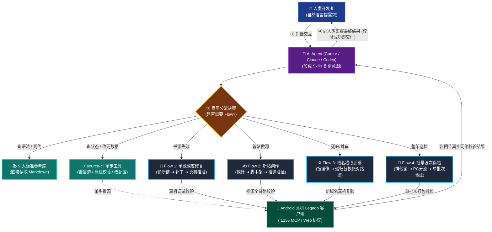

# 📚 legadoSkill

<p align="center">
  <b>现代化 Legado (开源阅读) 书源自动化开发、深度修复引擎与多 Agent 智能体技能标准体系</b><br>
  <b>A Modern Legado Book-Source Engineering Platform: Rust Engine, MCP Real-Device Automation & Multi-Agent Skills</b>
</p>

<p align="center">
  <a href="README.md"><b>简体中文</b></a> | <a href="README_EN.md"><b>English</b></a>
</p>

<p align="center">
  <a href="https://www.rust-lang.org/"></a>
  <a href="LICENSE"></a>
  <a href="https://modelcontextprotocol.io/"></a>
  <a href="https://github.com/gedoor/legado"></a>
</p>

---

## 📖 项目定位 (Overview)

`legadoSkill` 是专为 Android **[Legado (开源阅读 3.0+)](https://github.com/gedoor/legado)** 打造的现代化书源工程开发套件与自动化运维基础设施。

在 Legado 生态中，书源规则非常脆弱（涵盖 CSS/JQuery 选择器、XPath、JSONPath、正则提取、Rhino JS 引擎、加密解密、登录鉴权、反爬对抗等）。当目标网站改版、域名变更或增加防护盾时，传统的手工抓包与调试极其耗时耗力。

本项目将书源开发与修复演进为**工业级自动化工程体系**：
- **纯 Rust 全栈重写**：告别散装低效的 Python 脚本，提供毫秒级响应的高性能命令行工具 `source-cli`。
- **真机闭环联动**：通过 **MCP (Model Context Protocol)** 协议直连 Android 设备端 Legado 官方客户端，实现**“分析 -> 编写 -> 推送 -> 调试 -> 真机验证”**全自动化闭环。
- **多 Agent 智能体技能**：原生赋能 Claude Code、Codex、Cursor、Hermes 等主流 AI 编码助手，内置 9 大专业规约参考库与单向排障直觉。
- **人类极简体验**：人类用户无需死记硬背复杂的 CLI 命令与参数，只需开启手机服务并与 AI 对话，AI 智能体即可全自主在后台驱动引擎完成一切工作。

---

## ⚡ 与上游 (Upstream) 的核心差异

本项目派生自 `rezmdie/legadoSkill`，但经过彻底的架构迭代与工程化重构，现已完全脱胎换骨：

| 维度 | 上游原版 (`rezmdie/legadoSkill`) | 本项目 (`h11128/legadoSkill`) |
|---|---|---|
| **技术栈底层** | Python (LangChain / LangGraph) + 散装脚本 | **全栈 Rust 1.75+**，6 大高内聚分层 Crates，零 Python 运行时依赖 |
| **执行效率** | 启动慢，高并发批量分析易崩溃 | 毫秒级启动，极低内存开销，支持多线程高并发探针与波次调度 |
| **调试验证方式** | 依赖本地模拟器或虚假规则推测，容易出现“本地成功、手机报错” | **MCP 真机自动化闭环**：直连 Android 真机 `debug_source` 与 `check_source`，以真机返回为唯一真理 |
| **排障认知机制** | 缺乏层级防守，常在搜索未通过时盲改正文或目录 | **严格单向诊断链** (`Search -> Detail -> TOC -> Content`)，自动识别频控告警、验证码、CF 盾并阻断无效改动 |
| **系统架构** | 混乱的脚本目录，包含大量冗余资产与已失效的 IDE 捆绑包 | 严格分层的 **6 大 Crate 模块化工作区**，内建 SQLite 状态持久化与信道防死锁保护 |
| **知识库与技能** | 非结构化的散落 txt/md，存在多处过时描述与死链接 | **9 大结构化规约手册**，覆盖加解密、选择器、Cookie 鉴权、过盾、订阅源规范，对齐最新 Legado 源码 |
| **智能体兼容性** | 仅支持单一 IDE / Prompt 粘贴 | 统一的 **Multi-Agent Skills 标准**，无缝适配 Cursor, Claude Code, Codex, Hermes |

---

## 🏗 系统全景架构与调度路由 (Architecture & Dispatcher)

下图展示了**人类、AI Agent、Rust 引擎与 Android 真机之间的闭环协同**。系统根据任务类型智能分流，**纯检索和单步操作完全直连，仅复杂多阶段任务才进入对应独立 Flow**：



### 6 大分层 Crate 职责表

工程核心位于 `crates/` 目录下：

| Crate 模块 | 层级职责 | 核心模块包含 |
|---|---|---|
| **`source-core`** | 业务契约与基础类型 | `source-types` (实体), `source-contracts` (Schema), `source-identify` (站点指纹), `source-pattern` (特征聚类), `source-video` (视音频流) |
| **`source-storage`** | 状态持久化与缓存 | `source-db` (嵌入式 SQLite), `source-cache` (EWMA 频控冷却与域名状态) |
| **`source-engine`** | 规则解析与探测 | `source-parse` (选择器/解析), `source-diagnose` (单向排障链), `source-probe` (网络与表单探针) |
| **`source-flow`** | 编排与工作流 | `source-patch` (补丁生成), `source-migrate` (域名替换), `source-hunt` (新站搜寻), `source-queue` (波次调度), `source-closeout` (收尾门禁) |
| **`source-mcp`** | 真机接口与通信 | `source-adapters` (Legado 接口映射), `source-mcp` (MCP 协议), `source-check` (真机批检桥接) |
| **`source-cli`** | 统一操作终端 | 诊断、修复、推源、探针、巡检、波次修复全部子命令 |

---

## 🌊 业务流程全景与调度决策 (Flow Architecture & Dispatch)

在处理书源工程任务时，系统通过 **Flow（多阶段事务性流水线）** 保证真机互斥、频控保护与状态机一致性。

### 1. 什么时候调用 Flow vs 什么时候不需要 Flow？

| 业务场景 | 是否调用 Flow？ | 推荐执行路径 | 核心原因与设计考量 |
|---|---|---|---|
| **现有书源失效要排查修复** | **必须调用 Flow** | **Flow 1: 单源深度修复流** (`diagnose` -> `repair`) | 严格遵守 `搜索->详情->目录->正文` 诊断链，真机校验变绿才算修复。 |
| **为新发现的小说站制作书源** | **必须调用 Flow** | **Flow 2: 新书源创作流** (`site-probe` -> `scaffold` -> `push`) | 完整执行原生 HTML 探针、编码识别、脚手架生成与真机全链路校验。 |
| **站点域名挂死或跳博彩** | **必须调用 Flow** | **Flow 3: 域名猎取迁移流** (`hunt` -> `probe` -> `migrate`) | 禁止盲目修改规则，必须通过种子库搜寻有效镜像站并全量替换绝对路径。 |
| **书架书源批量全面巡检** | **必须调用 Flow** | **Flow 4: 批量巡检波次流** (`wave` / `search-wave`) | 必须持有全局排他信道锁，多线程 PC 预检后单批次交由真机验证。 |
| **查询 CSS 语法、JS 拓展或加解密方法** | ❌ **不需要 Flow** | **直接查阅标准参考库** (`skills/references/`) | 纯只读知识检索，无需接触设备与运行时。 |
| **检查手机 MCP 是否在线空闲** | ❌ **不需要 Flow** | **执行单条状态查询** (`source-cli check channel`) | 纯只读状态探测，无多阶段依赖。 |
| **微调书源名称、分组或翻页间隔** | ❌ **不需要 Flow** | **直接修改 JSON 文件** 并单步推送到手机 | 纯静态属性调整，不影响正文抓取链路，无需启动诊断流水线。 |
| **发现页 (exploreUrl) 规则调整** | ❌ **默认不走 Flow** | 仅在用户**明确要求**时才介入 | 平台纪律：默认 `checkDiscovery=false`，杜绝为信息流浪费真机配额。 |

### 2. 4 大核心 Flow 速查管道 (Compact Pipeline Cards)

- 🔧 **Flow 1: 单源深度修复流 (Deep Repair Flow)**
  > `[信道排他门禁]` ➔ `[L0~L2 存活门禁]` ➔ `[单向诊断链]` ➔ `[补丁计划]` ➔ `[推源真机校验]` ➔ `[台账关单]`
  - **触发时机**：现有书源搜索失效、详情报错、目录乱码或正文为空。
  - **核心铁律**：搜索未走通前严禁修改目录正文；未在真机校验变绿严禁宣称修复。

- ✍️ **Flow 2: 新书源创作流 (Source Creation Flow)**
  > `[原生探针扫描]` ➔ `[站群家族识别]` ➔ `[脚手架生成]` ➔ `[选择器增强]` ➔ `[推源全绿走通]` ➔ `[版本入库]`
  - **触发时机**：发现新的小说网站，需要从零开发书源。
  - **核心铁律**：必须以手机端真机四环节全绿为交付标准。

- 🌐 **Flow 3: 域名猎取迁移流 (Domain Hunt & Migration Flow)**
  > `[死链/挂站告警]` ➔ `[种子库搜镜像]` ➔ `[候选连通性探针]` ➔ `[全源绝对路径替换]` ➔ `[新域真机复验]`
  - **触发时机**：站点 404、挂马停放或跳转博彩站。
  - **核心铁律**：严禁乱改选择器规则，核心是域名挖掘与全源绝对路径全局替换。

- 🌊 **Flow 4: 批量巡检波次流 (Batch Wave Triage Flow)**
  > `[排他信道锁]` ➔ `[死站门禁过滤]` ➔ `[PC并发多维分流]` ➔ `[单批次下发真机]` ➔ `[聚合巡检报告]`
  - **触发时机**：书架几十上百个源的日常体检与批量分流修复。
  - **核心铁律**：严禁在同一台手机上并发多批次，必须单批次执行。

> 📖 **深入阅读**：四大 Flow 详细状态机、失败重试预算与流转拓扑图请参阅：[**业务流程全景架构与调度决策指南 (docs/reference/flow-architecture-and-dispatch.md)**](docs/reference/flow-architecture-and-dispatch.md)。

---

## 🚀 快速上手 (Quick Start & Onboarding)

### 👤 针对人类用户：零记忆、纯自然语言上手

**你不需要死记硬背任何复杂的 CLI 命令！** 本项目的核心理念就是让 AI Agent 承担一切繁重的工程执行，你只需按以下 2 步操作：

#### 步骤 1：连接手机与配置 IP
1. 确保手机和电脑连接在**同一个 Wi-Fi 网络**。
2. 打开手机上的 **Legado (开源阅读)**，进入 **「我的」->「Web服务」** 并开启；或者开启内置的 **MCP 服务**（默认端口 `1236`）。
3. 打开本项目根目录下的 [`config/mcp_defaults.json`](config/mcp_defaults.json)，将 `device_ip` 改为你手机当前的局域网 IP（例如 `192.168.1.100`）。

#### 步骤 2：在 AI 工具中直接下达自然语言指令
在 Cursor、Claude Code、Codex 或 Hermes 中直接对话即可：
- 🗣️ **“帮我修复这个书源，搜索失效了：`https://www.example-novel.com`”**
- 🗣️ **“我发现了一个新的小说网站 `https://novel.sample.com`，帮我写一个书源并推送到手机上测试。”**
- 🗣️ **“把书架里报错的书源批量巡检一遍，能修的自动修掉。”**

Agent 会自动载入 Skills，在后台调度 `source-cli` 自动完成探针、生成规则、推送到手机、执行真机验证，并在手机验证通过后向你汇报！

---

### 🤖 针对 AI Agent 与 CLI 高级开发者：底层命令与工作流

当 Agent 在后台执行任务，或开发者需要手动排查时，使用 `source-cli` 交互：

#### 1. 编译安装
```bash
cd crates
cargo build --release -p source_cli
cargo install --path source-cli --force
source-cli --help
```

#### 2. 场景 A：失效书源深度诊断与修复
```bash
# 1. 确保通道空闲（防挂死冲突）
source-cli check channel

# 2. 单源诊断：严格按单向诊断链自动嗅探各层问题
source-cli diagnose --url "https://target-site.com" --key "我的"

# 3. 自动生成补丁、推到真机并执行单步校验
source-cli repair --mode oneshot --url "https://target-site.com"

# 4. 记录台账与经验沉淀（闭环收工门禁）
source-cli ledger append --url "https://target-site.com" --step check --result "校验成功"
source-cli retro append --url "https://target-site.com" --status fixed --trap "搜索改为POST且需GBK编码" --skill-fix 0
```

#### 3. 场景 B：从零创作新站书源
```bash
# 1. 站点结构、编码、搜索表单探针扫描
source-cli site-probe --url "https://new-site.com"

# 2. 基于探测特征生成书源脚手架
source-cli source scaffold --host "new-site.com" --type biquge --name "笔趣新站"

# 3. 推送到真机 Legado（自动申明 deep_active 锁）
source-cli source push --file temp/new_source.json

# 4. 真机全链路检验，校验成功后完成关门
```

#### 4. 场景 C：批量巡检与波次调度
```bash
# 多线程并发波次修复
source-cli wave --urls-file failing_urls.txt --thread-count 8
```

---

## 🤖 多 Agent 技能配置 (Multi-Agent Integration)

本项目专为 AI 辅助编程深度优化，支持主流 AI 编程助手：

- **技能核心入口**：`skills/legado-book-source`（书源创作）与 `skills/legado-book-source-repair`（书源修复）。
- **多端同步配置**：参考详细指南 [`MULTI_AGENT_SETUP.md`](MULTI_AGENT_SETUP.md)。
- **排障心法与硬纪律**：
  1. **真机未验过绝不宣称修复成功**：严禁凭“本地脚本跑通”就向人类汇报完成，以手机返回为准。
  2. **严格单向诊断链**：`搜索 -> 详情 -> 目录 -> 正文`，搜索未通前严禁修改目录或正文。
  3. **频控保护与反爬嗅探**：遇到 `alert("搜索间隔")`、403、5 秒盾时，依靠 EWMA 冷却机制，严禁乱改选择器。
  4. **动态内容加权**：遇到 JS 动态渲染时，使用 `,{"webView": true}`（二级规则使用 `##$##,{"webView":true}`）。
  5. **负向禁止约束**：Legado 引擎不存在 `ruleContent.prevContentUrl`；禁止从 `<select>` 直接提取 `@value`（应写 `select option@value`）。

---

## 📚 9 大标准参考库索引 (Skills References)

位于 [`skills/legado-book-source/references/`](skills/legado-book-source/references/)，供 Agent 与开发者在开发时按需查阅：

1. 📑 **[书源核心 Schema 与模板](skills/legado-book-source/references/source-schema-template.md)** - 必填字段、类型约束与标准输出模板。
2. 🎯 **[CSS 选择器与伪类规范](skills/legado-book-source/references/css-rules.md)** - Legado 定制伪类（`:matches`, `:has` 等）与选择器提取语法。
3. ⚙️ **[JS 拓展函数与内置对象](skills/legado-book-source/references/js-extensions.md)** - `java.*` 内置桥接函数（`java.ajax()`, `java.base64Decode()`, `java.log()` 等）与执行生命周期。
4. 🔐 **[加解密与编码转换算法](skills/legado-book-source/references/crypto-methods.md)** - AES、DES、RSA、RC4、MD5 及自定义解密脚本。
5. 🛡️ **[反爬绕过与验证码防范](skills/legado-book-source/references/bypass-verification.md)** - Cloudflare 盾、字体混淆、验证码识别及滑块应对方案。
6. 🔑 **[登录状态维护与 Cookie 鉴权](skills/legado-book-source/references/login-and-auth.md)** - 登录表单构建、Cookie 跨步传递与自动续期。
7. 🔤 **[编码识别与乱码修复指南](skills/legado-book-source/references/encoding-guide.md)** - GBK / UTF-8 嗅探、URL 转码与响应解码实战。
8. 📡 **[订阅源完整开发规范](skills/legado-book-source/references/subscription-rules.md)** - 订阅源配置、发现页瀑布流与更新规则。
9. 💡 **[高级排障直觉与避坑速查](skills/legado-book-source/references/advanced-features.md)** - 倒序目录、瀑布流分页、动态目录合并与负向禁令速查。

---

## ⚙️ 配置文件说明 (Configuration)

详见 [`config/README.md`](config/README.md)。核心事实源为 [`config/mcp_defaults.json`](config/mcp_defaults.json)，门禁与黑白名单位于 [`config/verify_skip_rules.json`](config/verify_skip_rules.json)，数据契约位于 [`config/repair_contracts/`](config/repair_contracts/)。

---

## ❓ 常见问题 (FAQ & Troubleshooting)

### Q1: `source-cli check channel` 显示超时或连不上手机？
- 请检查手机与电脑是否处于同一 Wi-Fi，且路由器未开启 AP 隔离（Guest 隔离）。
- 打开手机浏览器，访问 `http://<手机IP>:1236` 确认 Legado 服务是否正常运行。
- 确认 `config/mcp_defaults.json` 中的 IP 与端口正确。

### Q2: 搜索结果明明页面有内容，但返回 0 条？
- 请检查 HTTP 返回日志中是否存在 `alert("搜索间隔")`、`频繁请求` 或验证码拦截。
- 如果网站有搜索间隔保护，切勿重写选择器，请等待冷却时间后再重试。

### Q3: 目录加载出来了，但章节顺序是反的？
- 在目录列表选择器前加上减号 `-` 即可自动倒序，例如 `-ul.chapters li`。

### Q4: 正文提取出来包含大段广告？
- 优先在规则末尾追加 `@ownText`，例如 `div#content@ownText`，可以自动剔除内部子标签包裹的嵌套广告。

---

## 🙏 致谢与溯源 (Acknowledgments & Heritage)

- 本项目最早派生（Fork）自 [rezmdie/legadoSkill](https://github.com/rezmdie/legadoSkill)，感谢原作者在早期通过 AI 探索 Legado 书源辅助生成所做的开创性工作与思路启发。
- 随着工程与业务场景的深入演进，本项目现已完全重写为纯 Rust 分层架构，建立了基于 MCP 的 Android 真机验证闭环与完备的排障规则体系，现作为独立的工程化项目持续维护与迭代。
- 同时向 [开源阅读 (Legado)](https://github.com/gedoor/legado) 及其开源社区致敬，感谢其提供了如此强大、灵活且自由的移动端阅读引擎。

---

## 📄 开源许可证 (License)

本项目遵循 [MIT License](LICENSE) 开源协议。

