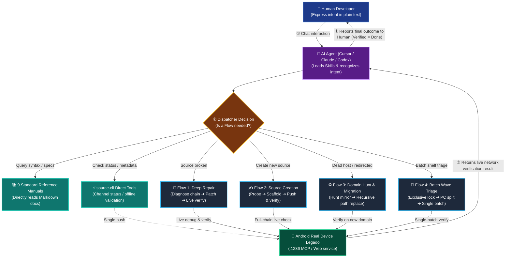

# 📚 legadoSkill

<p align="center">
  <b>A Modern Legado Book-Source Engineering Platform: Rust Engine, MCP Real-Device Automation & Multi-Agent Skills</b><br>
  <b>现代化 Legado (开源阅读) 书源自动化开发、深度修复引擎与多 Agent 智能体技能标准体系</b>
</p>

<p align="center">
  <a href="README.md"><b>简体中文</b></a> | <a href="README_EN.md"><b>English</b></a>
</p>

<p align="center">
  <a href="https://www.rust-lang.org/"></a>
  <a href="LICENSE"></a>
  <a href="https://modelcontextprotocol.io/"></a>
  <a href="https://github.com/gedoor/legado"></a>
</p>

---

## 📖 Overview

`legadoSkill` is a modern book-source development toolkit and automated maintenance infrastructure designed for the Android **[Legado (阅读 3.0+)](https://github.com/gedoor/legado)** reading application.

Legado book source rules are notoriously delicate (spanning CSS/JQuery selectors, XPath, JSONPath, regular expressions, Rhino JS engines, encryption/decryption, login authentication, and anti-scraping challenges). When target websites update their DOM, rotate domains, or introduce bot protection, manual debugging becomes exhausting.

`legadoSkill` transforms book source engineering into an **industrial-grade automated system**:
- **Full Rust Rewrite**: Replaces ad-hoc Python scripts with a high-performance, single-binary CLI (`source-cli`).
- **Real-Device MCP Automation**: Connects directly to the Android Legado app via the **Model Context Protocol (MCP)**, forming a complete closed loop: **Analyze -> Draft -> Push -> Debug -> Real-Device Verify**.
- **Multi-Agent Skills**: Equips AI coding assistants (Claude Code, Codex, Cursor, Hermes) with 9 standard reference manuals and strict diagnostic heuristics.
- **Effortless for Humans**: Human developers do not need to memorize or type complex CLI commands! Simply talk to your AI Agent in natural language while your phone handles live verification in the background.

---

## ⚡ Comparison with Upstream

This repository originated from `rezmdie/legadoSkill` but has undergone a complete architectural rewrite:

| Dimension | Upstream (`rezmdie/legadoSkill`) | This Project (`h11128/legadoSkill`) |
|---|---|---|
| **Underlying Stack** | Python (LangChain / LangGraph) + loose scripts | **Pure Rust 1.75+**, 6 consolidated layer crates, zero Python runtime dependency |
| **Execution Performance** | Slow cold start, prone to out-of-memory errors during batch processing | Sub-millisecond startup, minimal footprint, concurrent multi-worker scanning & wave scheduling |
| **Verification Method** | Local DOM approximation / guessing ("worked locally, failed on phone") | **MCP Real-Device Closed Loop**: Direct connection to Android Legado `debug_source` & `check_source`; the device is the single source of truth |
| **Diagnostic Discipline** | Lacks layered isolation; frequently rewrote TOC or Content before search worked | **Strict Unidirectional Diagnostic Chain** (`Search -> Detail -> TOC -> Content`); automatically detects rate-limiting alerts, captchas, and Cloudflare challenges |
| **Codebase Quality** | Cluttered legacy assets, dead links, and broken Trae IDE download badges | Modular **6-layer crate workspace**, embedded SQLite persistence, and deadlock prevention channel locks |
| **Knowledge Base** | Unstructured, duplicated text files with obsolete guidelines | **9 comprehensive reference manuals** covering crypto, custom CSS pseudo-classes, cookie auth, bypasses, and subscription rules |
| **Agent Support** | Single-prompt copy-paste | Standardized **Multi-Agent Skills** compatible with Cursor, Claude Code, Codex, and Hermes |

---

## 🏗 System Architecture Diagram



### 6 Layer Crates Breakdown

The codebase in `crates/` is strictly partitioned:

| Crate | Layer Role | Included Components |
|---|---|---|
| **`source-core`** | Domain contracts & types | `source-types` (entities), `source-contracts` (schemas), `source-identify` (fingerprints), `source-pattern` (clustering), `source-video` (media rules) |
| **`source-storage`** | Persistence & caching | `source-db` (embedded SQLite), `source-cache` (EWMA cooldown & domain statuses) |
| **`source-engine`** | Rule evaluation & diagnosis | `source-parse` (CSS/JS/regex parser), `source-diagnose` (diagnostic chain), `source-probe` (web & form probes) |
| **`source-flow`** | Workflow orchestration | `source-patch` (patch generator), `source-migrate` (domain rewrite), `source-hunt` (domain hunter), `source-queue` (wave scheduler), `source-closeout` (gatekeeper) |
| **`source-mcp`** | Device communications | `source-adapters` (Legado API bridge), `source-mcp` (MCP protocol client), `source-check` (device check bridge) |
| **`source-cli`** | User command interface | Unified commands for diagnose, repair, push, site-probe, and batch waves |

---

## 🌊 Flow Architecture & Dispatch Strategy

When handling book-source tasks, the system coordinates multi-stage actions through **Flows (transactional pipelines)** to ensure device isolation, rate-limit protection, and state-machine consistency.

### 1. When to Invoke a Flow vs. When NOT to Invoke a Flow

| Task / Scenario | Invoke a Flow? | Recommended Dispatch Path | Rationale & Architectural Design |
|---|---|---|---|
| **Fixing a broken book source** | **Must Invoke Flow** | **Flow 1: Deep Repair Flow** (`diagnose` -> `repair`) | Enforces `Search -> Detail -> TOC -> Content` diagnostic chain; must pass real-device verify. |
| **Creating a source for a new site** | **Must Invoke Flow** | **Flow 2: Source Creation Flow** (`site-probe` -> `scaffold` -> `push`) | Fully executes raw HTML probing, encoding detection, scaffold drafting, and live phone verification. |
| **Domain dead (404/expired/redirected)** | **Must Invoke Flow** | **Flow 3: Domain Hunt & Migration** (`hunt` -> `probe` -> `migrate`) | Do NOT alter selectors; search for mirror domains and recursively migrate all absolute paths. |
| **Batch health checks on book collection** | **Must Invoke Flow** | **Flow 4: Batch Wave Triage** (`wave` / `search-wave`) | Must acquire exclusive channel lock, run parallel PC triage, and dispatch one batch to phone. |
| **Querying CSS syntax, JS helpers, or crypto** | ❌ **Do NOT Invoke Flow** | **Directly read Reference Manuals** (`skills/references/`) | Read-only knowledge retrieval; no runtime or device side effects. |
| **Checking phone MCP connection / idle status** | ❌ **Do NOT Invoke Flow** | **Execute single probe command** (`source-cli check channel`) | Single-flight status check; no multi-step state machine needed. |
| **Modifying source name, group, or intervals** | ❌ **Do NOT Invoke Flow** | **Directly edit JSON** and push single file | Non-functional metadata tweak; does not require full diagnostic pipeline. |
| **Explore / Discovery page adjustments** | ❌ **Off by default** | Only when **explicitly requested** by user | Platform discipline: `checkDiscovery=false` by default to conserve phone execution budget. |

### 2. 4 Core Flows Compact Pipeline Cards

- 🔧 **Flow 1: Deep Repair Flow**
  > `[Channel Gate]` ➔ `[L0~L2 Gates]` ➔ `[Diagnostic Chain]` ➔ `[Patch Plan]` ➔ `[Push & Live Verify]` ➔ `[Closeout Ledger]`
  - **Trigger**: Search fails, book detail crashes, TOC is garbled, or chapter body is empty.
  - **Hard Rule**: Never rewrite TOC/Content selectors before Search succeeds; never claim fixed without phone green verification.

- ✍️ **Flow 2: Source Creation Flow**
  > `[Live Site Probe]` ➔ `[Family Fingerprint]` ➔ `[Scaffold Generation]` ➔ `[Selector Refinement]` ➔ `[Live Push & Verify]` ➔ `[Source Cataloged]`
  - **Trigger**: New novel site discovered; needs source developed from scratch.
  - **Hard Rule**: All 4 stages (Search, Detail, TOC, Content) must pass live phone verification before acceptance.

- 🌐 **Flow 3: Domain Hunt & Migration Flow**
  > `[Dead Host Alert]` ➔ `[Seed Search]` ➔ `[Candidate Probe]` ➔ `[Recursive Path Replace]` ➔ `[Verify on New Host]`
  - **Trigger**: Target host returns 404, park page, or redirects to gambling sites.
  - **Hard Rule**: Never tamper with selector rules; focus entirely on discovering mirror hosts and replacing absolute domain paths.

- 🌊 **Flow 4: Batch Wave Triage Flow**
  > `[Exclusive Lock]` ➔ `[Dead Host Filter]` ➔ `[Parallel PC Triage]` ➔ `[Single-Batch Phone Verify]` ➔ `[Aggregate Report]`
  - **Trigger**: Routine health check and batch triage across dozens/hundreds of shelf sources.
  - **Hard Rule**: Never run concurrent check batches against the same phone; must execute strictly in a single batch.

> 📖 **Deep Dive**: For complete state machine transitions, timeout budgets, and topology diagrams, see: [**Flow Architecture & Dispatch Guide (docs/reference/flow-architecture-and-dispatch.md)**](docs/reference/flow-architecture-and-dispatch.md).

---

## 🚀 Quick Start & Onboarding

### 👤 For Humans: Zero Memorization, Natural Language Only

**You do not need to memorize or type complex CLI commands!** The core philosophy of this project is to let AI Agents handle the heavy engineering lifting. You only need two simple steps:

#### Step 1: Connect Phone and Configure IP
1. Ensure your phone and computer are connected to the **same Wi-Fi network**.
2. Open **Legado (开源阅读)** on your phone, go to **"My" -> "Web Service"** and enable it; or enable the built-in **MCP Service** (default port: `1236`).
3. Open [`config/mcp_defaults.json`](config/mcp_defaults.json) in this repository and update `device_ip` to your phone's LAN IP (e.g. `192.168.1.100`).

#### Step 2: Talk to Your AI Assistant
In Cursor, Claude Code, Codex, or Hermes, chat directly using natural language:
- 🗣️ **"Fix this book source, search is broken: `https://www.example-novel.com`"**
- 🗣️ **"I found a new novel site `https://novel.sample.com`, please create a working book source and push it to my phone."**
- 🗣️ **"Check all book sources in my library and auto-repair any broken ones."**

Your AI Agent will automatically invoke skills, run `source-cli` in the background, push candidate rules to the phone, verify them in live execution, and report back once verified!

---

### 🤖 For AI Agents & CLI Power Users: Underlying Commands

When an Agent works autonomously or a developer needs manual inspection, use `source-cli`:

#### 1. Build and Install CLI
```bash
cd crates
cargo build --release -p source_cli
cargo install --path source-cli --force
source-cli --help
```

#### 2. Scenario A: Deep Diagnostic & Repair Workflow
```bash
# 1. Verify channel is idle
source-cli check channel

# 2. Run diagnosis along the strict unidirectional chain
source-cli diagnose --url "https://target-site.com" --key "我的"

# 3. Generate patch, push to real device, and verify
source-cli repair --mode oneshot --url "https://target-site.com"

# 4. Record ledger entry and lessons learned (mandatory closeout gate)
source-cli ledger append --url "https://target-site.com" --step check --result "校验成功"
source-cli retro append --url "https://target-site.com" --status fixed --trap "Search converted to POST with GBK" --skill-fix 0
```

#### 3. Scenario B: Create a Book Source from Scratch
```bash
# 1. Probe target site structure, encoding, and search forms
source-cli site-probe --url "https://new-site.com"

# 2. Generate scaffold based on recognized patterns
source-cli source scaffold --host "new-site.com" --type biquge --name "Biquge Mirror"

# 3. Push to real device Legado (claims deep_active lock)
source-cli source push --file temp/new_source.json

# 4. Trigger full verification and seal upon live success
```

#### 4. Scenario C: Batch Wave Triage
```bash
# Concurrent multi-worker wave repair
source-cli wave --urls-file failing_urls.txt --thread-count 8
```

---

## 🤖 AI Agent Integration

This workspace is natively tailored for AI pair-programming:

- **Skill Entries**: `skills/legado-book-source` (creation) and `skills/legado-book-source-repair` (repair).
- **Multi-Agent Setup**: See [`MULTI_AGENT_SETUP.md`](MULTI_AGENT_SETUP.md) for configuration details.
- **Core Engineering Disciplines**:
  1. **Never claim fixed without device verification**: Local parsing success is not proof that the Legado app can read the source.
  2. **Strict Unidirectional Diagnostic Chain**: `Search -> Detail -> TOC -> Content`. Never alter TOC or Content rules before search produces verified book links.
  3. **Respect Rate Limits**: When encountering `alert("搜索间隔")`, 403 status, or Cloudflare challenges, honor EWMA cooldown periods instead of rewriting selectors.
  4. **Dynamic Webview Rendering**: Append `,{"webView": true}` for JS-rendered pages (for sub-rules like `chapterUrl`, use `##$##,{"webView":true}`).
  5. **Negative Constraints**: The Legado engine does NOT have `ruleContent.prevContentUrl`; never extract `@value` directly from `<select>` (use `select option@value`).

---

## 📚 9 Standard References

Located in [`skills/legado-book-source/references/`](skills/legado-book-source/references/):

1. 📑 **[Source Schema & Template](skills/legado-book-source/references/source-schema-template.md)** - Required fields, type specifications, and standard JSON template.
2. 🎯 **[CSS Selectors & Pseudo-Classes](skills/legado-book-source/references/css-rules.md)** - Legado custom pseudo-classes (`:matches`, `:has`) and extraction modifiers.
3. ⚙️ **[JS Extensions & Built-in Objects](skills/legado-book-source/references/js-extensions.md)** - `java.*` helper functions (`java.ajax()`, `java.base64Decode()`, `java.log()`) and lifecycle rules.
4. 🔐 **[Cryptographic Algorithms & Ciphers](skills/legado-book-source/references/crypto-methods.md)** - AES, DES, RSA, RC4, MD5, and custom decryption patterns.
5. 🛡️ **[Bypassing Anti-Scraping & Captchas](skills/legado-book-source/references/bypass-verification.md)** - Cloudflare challenges, custom font de-obfuscation, and captcha handling.
6. 🔑 **[Login & Cookie Authentication](skills/legado-book-source/references/login-and-auth.md)** - Building login requests, cross-step cookie preservation, and session renewal.
7. 🔤 **[Encoding Detection & Mojibake Fixes](skills/legado-book-source/references/encoding-guide.md)** - GBK / UTF-8 detection, query string encoding, and response decoding.
8. 📡 **[Subscription Source Specifications](skills/legado-book-source/references/subscription-rules.md)** - Subscription feeds, discovery waterfall layouts, and update rules.
9. 💡 **[Advanced Troubleshooting & Anti-Patterns](skills/legado-book-source/references/advanced-features.md)** - Reversed catalogs, waterfall pagination, dynamic TOC merging, and negative bans.

---

## ⚙️ Configuration Guide

Detailed configuration docs can be found in [`config/README.md`](config/README.md). Device endpoints are maintained in [`config/mcp_defaults.json`](config/mcp_defaults.json), gate skipping rules in [`config/verify_skip_rules.json`](config/verify_skip_rules.json), and JSON contract schemas in [`config/repair_contracts/`](config/repair_contracts/).

---

## ❓ FAQ & Troubleshooting

### Q1: `source-cli check channel` times out or fails to connect to the phone?
- Verify that your PC and phone are connected to the same Wi-Fi and that AP isolation (Guest Mode) is disabled on your router.
- Open your browser and visit `http://<phone-ip>:1236` to verify Legado's web service is responsive.
- Verify `device_ip` and `device_port` in `config/mcp_defaults.json`.

### Q2: Search produces 0 results even though the page has content?
- Check the HTTP debug logs for `alert("搜索间隔")`, frequency limits, or captcha challenges.
- If the target host has a rate-limit interval, do NOT alter the selectors; wait for the cooldown timer.

### Q3: The catalog is reversed?
- Prepend `-` to the TOC list selector (e.g. `-ul.chapters li`).

### Q4: Chapter content contains ads?
- Prefer appending `@ownText` to your selector (e.g. `div#content@ownText`) to automatically discard ads nested in child tags.

---

## 📄 License

This project is licensed under the [MIT License](LICENSE).
