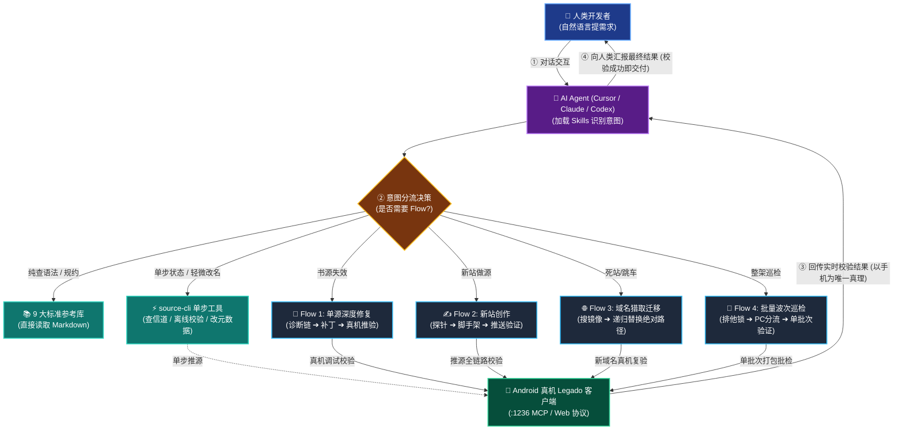
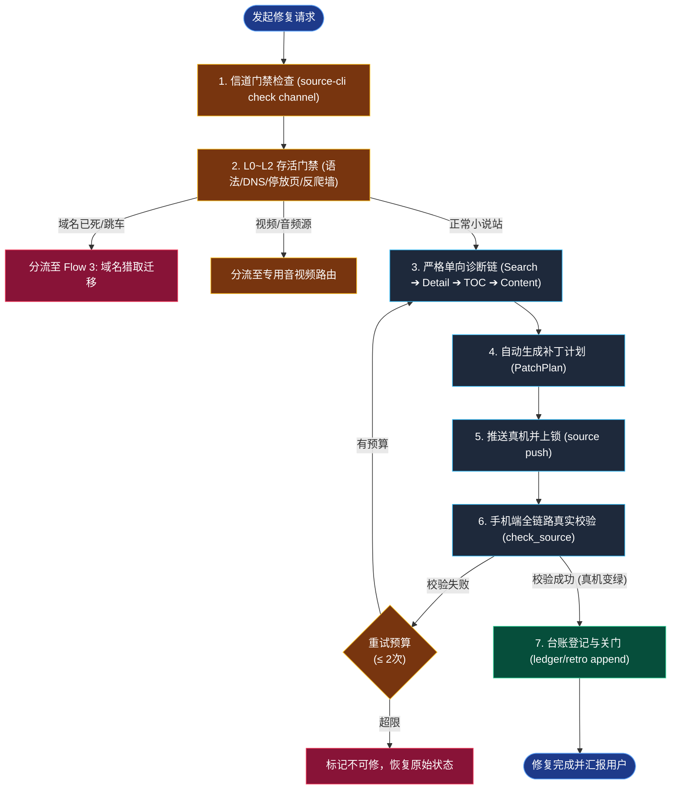
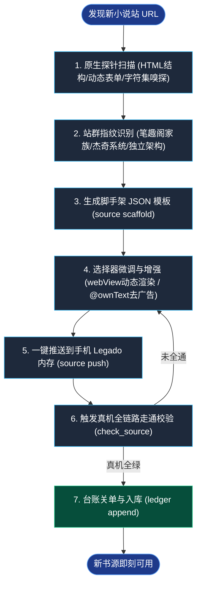
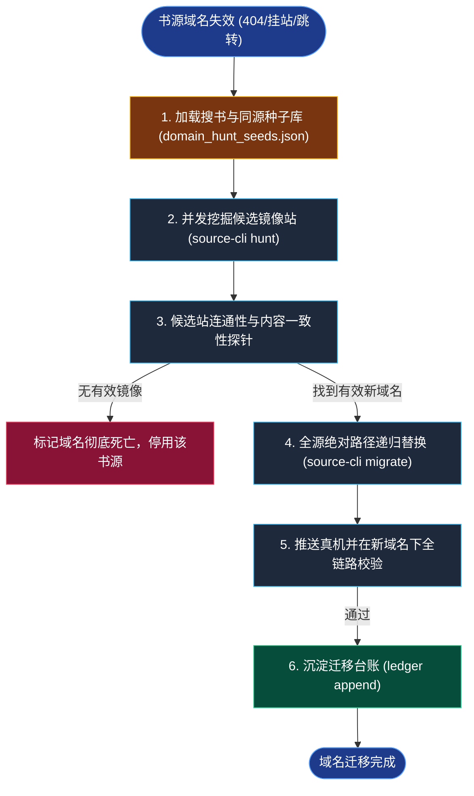
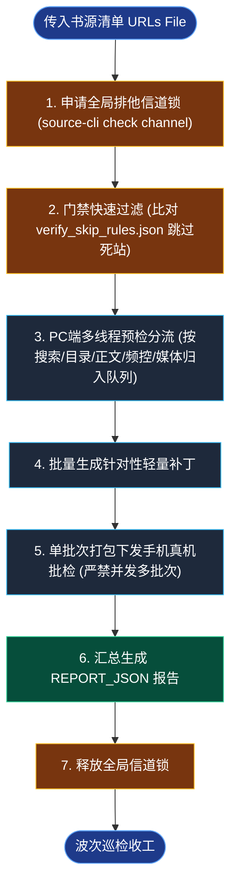

# 🌊 业务流程全景架构与调度决策指南 (Flow Architecture & Dispatch Guide)

> **定位说明**：本文档定义了 `legadoSkill` 平台中四大核心工作流（Flow）的状态机架构、流转拓扑，以及**何时调用 Flow 与何时直调工具（无需 Flow）**的判定矩阵，为开发者与 AI Agent 提供调度决策的事实源（SOT）。

---

## 一、什么是 Flow？为什么需要 Flow？

在 Legado 书源工程中，一次操作往往不是单条命令就能解决的：
- 它涉及**外部网络波动**（Cloudflare 盾、反爬频控、字符乱码）；
- 它涉及**严格的上下游因果依赖**（搜索没通前改目录毫无意义；没在真机验证前宣称修复是假修复）；
- 它涉及**真机硬件资源互斥**（一台 Android 手机同时只能承载一个真机调试/批检作业，否则会导致信道死锁）。

**Flow（工作流）** 是跨越多个底层模块（Gate、Diagnose、Patch、MCP、Verify、Closeout），具备**前置门禁拦截、中间状态保护、真机闭环验证与最终台账收工**的事务性多阶段流水线。

---

## 二、何时调用 Flow vs 何时不需要 Flow？（决策矩阵）

在接到人类指令或准备执行动作前，Agent 和开发者应先查阅下表决定是否唤起 Flow：

| 任务意图 / 场景 | 是否需要 Flow？ | 推荐调度路径 | 核心原因与设计考量 |
|---|---|---|---|
| **现有书源失效，需排查修复** | **必须调用 Flow** | **Flow 1: 单源深度修复流** (`source-cli diagnose` -> `repair`) | 必须执行 L0~L2 门禁与单向诊断链，杜绝盲目修改选择器；必须真机校验通过方可交付。 |
| **发现新小说站，需制作新书源** | **必须调用 Flow** | **Flow 2: 新书源创作流** (`source-cli site-probe` -> `scaffold` -> `push` -> `verify`) | 需完整经历原始 HTML 抓取、编码识别、脚手架生成、真机推送与全链路真机检验。 |
| **书源域名失效 (404/挂站/跳博彩)** | **必须调用 Flow** | **Flow 3: 域名猎取迁移流** (`source-cli hunt` -> `site-probe` -> `migrate`) | 不得胡乱改写解析规则，必须寻找镜像站，并在全源范围内递归替换主机路径。 |
| **书架大批量书源全面健康巡检** | **必须调用 Flow** | **Flow 4: 批量巡检波次流** (`source-cli wave` / `search-wave`) | 必须持有信道排他锁，执行多线程 PC 预检分流，并以单批次方式送入真机验证。 |
| **查询 CSS 语法、JS 拓展或加解密方法** | ❌ **不需要 Flow** | **直接查阅标准参考库** (`skills/legado-book-source/references/*.md`) | 纯只读知识检索，无需接触设备与运行时。 |
| **检查手机端 MCP 是否在线或空闲** | ❌ **不需要 Flow** | **直接执行单条状态查询** (`source-cli check channel`) | 纯状态查询工具，无多阶段依赖。 |
| **修改书源非功能性属性 (名称/分组/延时)** | ❌ **不需要 Flow** | **直接编辑 JSON 文件**，若需生效调 `source-cli source push` | 仅改变元数据或配置参数，不影响正文与目录抓取逻辑，无需启动整套诊断流水线。 |
| **发现页 (exploreUrl) 排障** | ❌ **默认不走 Flow** | 仅在用户**明确点名**要求时才介入 | 平台纪律：默认 `checkDiscovery=false`，发现页失效不影响正常阅书，杜绝浪费真机预算。 |
| **离线检测 JSON 结构是否符合 Legado 规范** | ❌ **不需要 Flow** | **本地单步 Schema 校验** (`source-contracts`) | 纯语法与契约校验，无需网络与手机通信。 |

---

## 三、统一调度与分流路由全景图

下图清晰展示了**不同任务的不同分流路径**：并非每次都调用 Flow，纯检索和单步操作完全绕开 Flow，各 Flow 之间也互不干扰：

---

## 四、4 大核心 Flow 独立执行规约

### Flow 1: 单源深度修复流 (Deep Repair Flow)

这是最高频的排障工作流，严格落实“单向诊断链”与“真机验证闭环”：

---

### Flow 2: 新书源创作流 (Source Creation Flow)

从零发现未知小说站点并生成工业级可用书源：

---

### Flow 3: 域名猎取与全量迁移流 (Domain Hunt & Migration Flow)

当目标站点更换域名、原域名解析失败或跳转博彩站时触发：

---

### Flow 4: 批量巡检与波次调度流 (Batch Wave Triage Flow)

针对几十到上百个书源的高并发、大批量体检与快速分流：

> **看门狗守护与防卡死熔断 (Watchdog & Hang Guard)**：
> 在执行大批量巡检调度（`source-cli serial`）时，系统启用默认 120 秒看门狗子进程守护（`--url-timeout-s 120`）并写入心跳文件 `temp/full_fix/serial_heartbeat.json`。
> 若手机端因死锁或大页面阻塞导致心跳停滞超过超时上限，看门狗将直接终止卡死子进程，自动触发 `source-cli check channel --force-clear` 释放信道，并将当前源标记为 `skip:url_timeout` 记录台账后自动推进下一任务，杜绝 Agent 挂死阻塞整轮作业。

---

## 五、核心防护与避坑纪律 (Hard Rules)

1. **信道互斥（One Device, One Flight）**：
   - 手机端 Legado 是单体进程，无法同时处理两个批检或高频并发调试任务。
   - 进入任何包含真机操作的 Flow 前，**必须先执行信道检查**；退出 Flow 时必须保证释放占用。
2. **频控严禁改写选择器（Rate Limit Shield）**：
   - 当诊断在 Search 层发现 `alert("搜索间隔")`、403 或 5 秒盾时，Flow 会立即将该任务置入冷却队列或挂起，**严禁在此类网络频控状态下改动原本正确的选择器**。
3. **关闭非必要环节（Discovery Off by Default）**：
   - Legado 书源的“发现”页规则（`ruleExplore`）仅用于书城信息流展示，与读者阅读核心流程无关。
   - 所有自动化 Flow 均强制配置 `checkDiscovery=false`，以节省珍贵的真机调试与网络流量预算。
